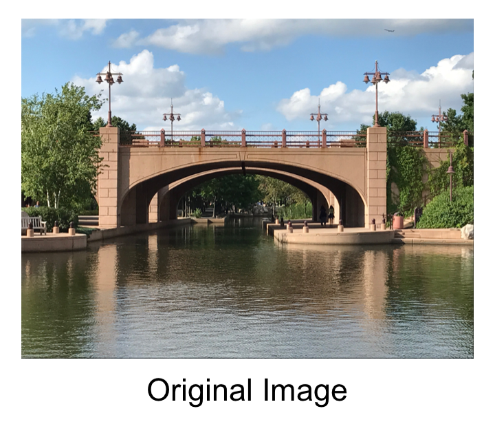

# Pixel Sorting 

A project for Algorithm Design and Analysis (Macalester College Comp 221) completed by Luke Brown, Jeremy Krovitz, and Emma Thole. 

* Pixel sorting algorithms are image processing methods that reoganize pixels in various ways to create altered images. 

* Using an image of their choice, a user selects their sorting criteria. and the algorithms sort the pixels in the image based on user selection.  

* The pixels in the image are reorganized and saved as a new image. 

&nbsp;&nbsp;&nbsp;

## Installation

### Downloading the Files and Opening the Zip File
1. Go to the [IFLAlgorithmsProject repository home page](https://github.com/jkrovitz/IFLAlgorithmsProject). 
2. Press **Clone or Download**
3. Click **Download Zip**
4. Uncompress the zip file. 

### Downloading InteliJ IDEA
[Download IntelliJ IDEA](https://www.jetbrains.com/idea/) for your operating system. For assistance, consult [Install and set up IntelliJ IDEA](https://www.jetbrains.com/help/idea/install-and-set-up-product.html).

## Using the Software

